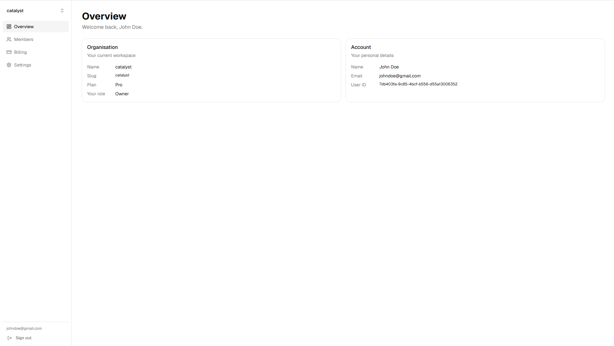

# Trellis

A full-stack multi-tenant SaaS starter. Built to be cloned, extended, and shipped.



---

## What's included

**Auth**

- Email/password registration and login
- Google OAuth with automatic account linking
- JWT access tokens + refresh tokens
- Protected routes with auth guards

**Multi-tenancy**

- Organisations with owner / admin / member roles
- Org switcher: users can belong to multiple orgs
- All data scoped to the current org at the middleware level

**Team management**

- Email invites with secure token links
- Role management and member removal
- Pending invite tracking with revocation

**Billing**

- Stripe Checkout for plan upgrades
- Stripe Billing Portal for subscription management
- Webhook handler keeps plan status in sync automatically

**Settings**

- Profile updates (name)
- Org name updates
- Org deletion with double confirmation

**Developer experience**

- Docker Compose for local dev (Postgres + Redis + backend + frontend)
- Alembic migrations
- 38 backend tests with SQLite in-memory DB (no Docker needed for tests)
- Auto-generated API docs at `/docs`

---

## Tech stack

| Layer         | Technology                                       |
| ------------- | ------------------------------------------------ |
| Frontend      | Next.js 14 (App Router), Tailwind CSS, shadcn/ui |
| Backend       | FastAPI, SQLAlchemy 2.0 (async), Alembic         |
| Database      | PostgreSQL                                       |
| Cache / Queue | Redis, Celery                                    |
| Auth          | JWT (PyJWT), bcrypt (passlib), Google OAuth      |
| Billing       | Stripe                                           |
| Infra         | Docker, GitHub Actions                           |
| Deployment    | Vercel (frontend), Fly.io (backend)              |

---

## Project structure

```
trellis/
├── frontend/               # Next.js app
│   ├── app/
│   │   ├── (auth)/         # Login, register, invite, OAuth callback
│   │   └── (dashboard)/    # Protected pages (overview, members, billing, settings)
│   ├── components/         # Shared UI components
│   └── lib/                # API client, auth context, org context
│
├── backend/
│   └── src/backend/
│       ├── api/v1/         # Route handlers (auth, orgs, invites, billing, oauth)
│       ├── models/         # SQLAlchemy models
│       ├── schemas/        # Pydantic request/response schemas
│       ├── services/       # Business logic
│       └── db/             # Session, migrations
│
├── docker-compose.yml
├── Dockerfile.backend
└── Dockerfile.frontend
```

---

## Getting started

### Prerequisites

- Docker + Docker Compose
- Node.js 20+
- Python 3.12+
- [uv](https://docs.astral.sh/uv/)

### 1. Clone and configure

```bash
git clone https://github.com/gomisroca/trellis.git
cd trellis
cp .env.example .env
```

Edit `.env` and fill in:

```dotenv
# Required
POSTGRES_USER=saas
POSTGRES_PASSWORD=your-password
POSTGRES_DB=saas_dev
SECRET_KEY=generate-a-long-random-string

# Optional - features degrade gracefully without these
GOOGLE_CLIENT_ID=...
GOOGLE_CLIENT_SECRET=...
STRIPE_SECRET_KEY=sk_test_...
STRIPE_WEBHOOK_SECRET=whsec_...
STRIPE_PRO_PRICE_ID=price_...
RESEND_API_KEY=re_...
```

Generate a secure `SECRET_KEY`:

```bash
python -c "import secrets; print(secrets.token_hex(32))"
```

### 2. Start the database

```bash
docker compose up db -d
```

### 3. Run backend migrations

```bash
cd backend
uv sync
uv run alembic upgrade head
```

### 4. Start the backend

```bash
uv run uvicorn backend.main:app --reload
```

API running at `http://localhost:8000` - interactive docs at `http://localhost:8000/docs`.

### 5. Start the frontend

```bash
cd frontend
cp .env.local.example .env.local   # set NEXT_PUBLIC_API_URL=http://localhost:8000
npm install
npm run dev
```

App running at `http://localhost:3000`.

### 6. (Optional) Start Stripe webhook forwarding

```bash
stripe listen --forward-to localhost:8000/api/v1/webhooks/stripe
```

Copy the printed `whsec_...` secret into `.env` as `STRIPE_WEBHOOK_SECRET` and restart the backend.

---

## Running tests

```bash
cd backend
uv run pytest -v
```

Tests use SQLite in-memory - no running database needed.

---

## Deployment

### Backend → Fly.io

```bash
fly launch
fly secrets set SECRET_KEY=... DATABASE_URL=... STRIPE_SECRET_KEY=...
fly deploy
```

After deploying, run migrations:

```bash
fly ssh console -C "cd /app && alembic upgrade head"
```

Register your production webhook URL in the Stripe dashboard:

```
https://your-app.fly.dev/api/v1/webhooks/stripe
```

### Frontend → Vercel

Push to GitHub and import the repo in Vercel. Set the root directory to `frontend` and add the environment variable:

```
NEXT_PUBLIC_API_URL=https://your-app.fly.dev
```

Add your production URLs to the Google OAuth client in Google Cloud Console:

- Authorised JavaScript origin: `https://your-frontend.vercel.app`
- Authorised redirect URI: `https://your-app.fly.dev/api/v1/auth/google/callback`

---

## Architecture decisions

**Why `tenant_id` row-level isolation instead of separate schemas?**
Simpler to manage with a single Alembic migration path, easier to query across orgs for admin tooling, and sufficient for most SaaS products. Schema-per-tenant is only worth the complexity at very high scale.

**Why JWTs instead of sessions?**
Stateless auth fits naturally with a separate frontend/backend deployment. The short-lived access token (30 min) + long-lived refresh token (30 days) pattern limits exposure if a token is leaked without forcing frequent re-logins.

**Why FastAPI over Django?**
Async-first, lightweight, and the automatic OpenAPI docs make the API self-documenting. SQLAlchemy gives the same ORM power as Django ORM without the framework lock-in.

---

## Roadmap

- [ ] Email verification on signup
- [ ] Audit log page
- [ ] Avatar upload
- [ ] Frontend tests (Vitest + Testing Library)
- [ ] Rate limiting

---

## Author

[gomisroca](https://github.com/gomisroca)
